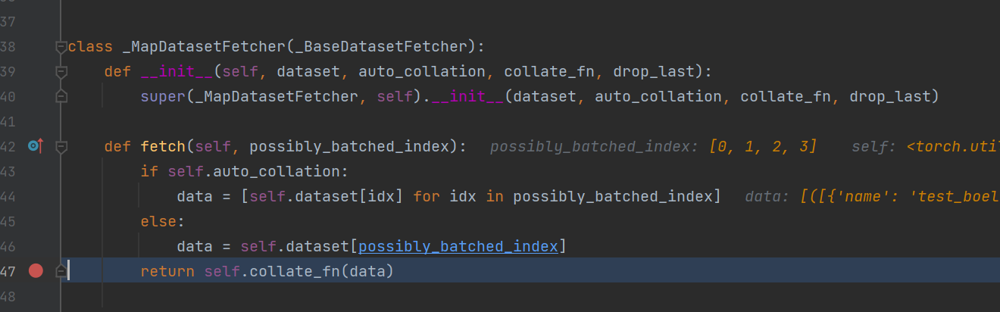

## 1. dataset vs. dataloader    

- dataset
    - `__getitem__(self, index)`
    - `__len__`

- dataloader
    - `__init__`
        - `dataset`
        - `batch_size`
        - `collate_fn`：如何打包处理 `batch_size` 个 dataset 的 `__getitem__`
            - 

