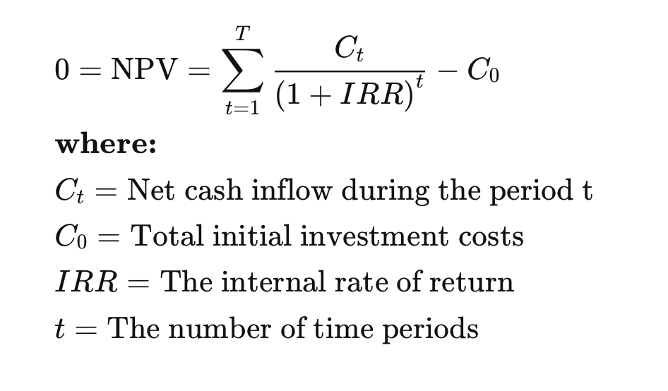

## 1. 会计

- 三张报表
    - 资产负债表
    - 损益表
    - 现金流量表

## 2. 经济

### 2.1 宏观经济

- 财政 vs. 货币
    - 积极的财政政策
        - 需要刺激经济时：货币增发（降准降息），m2增加；
    - 稳健的货币政策
        - 需要刺激经济时：增发国债，专项债，财政赤字会变大；

## 3. 金融

- npv 与 irr
    - npv: net present value
    - irr: internal rate of return
    - irr 就是 npv = 0 时对应的利率, irr 是 break-even point
    

