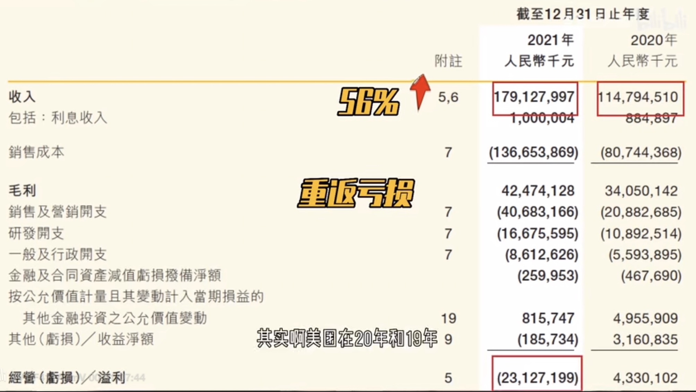
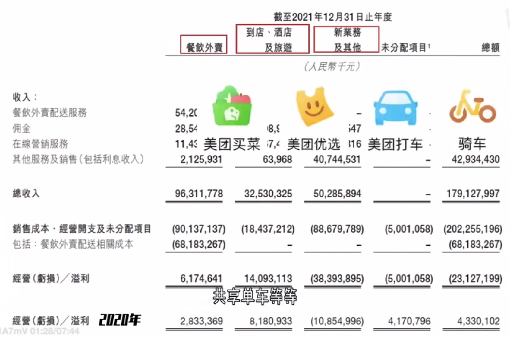

- basics
    - `()` 内的表示成本项支出项或亏损项；

- 2021年度（亏损）
    - 毛利 = 收入 - 销售成本
        - 42474128 = 179127997 - 136653869
    - 经营（亏损）/溢利 = 毛利 - 各项成本
        - -23127199 = 42474128 - 40683166 - 16675595 - 8612626 - 259953 + 815747 - 185734

- 按业务线拆分
    - 餐饮外卖
    - 到店、酒店及旅游
    - 新业务及其他（美团买菜，美团优选，美团打车，骑车）
    - 未分配项目

- 2020 vs. 2021

|\|餐饮外卖|到店、酒店及旅游|新业务及其他|未分配项目|总额|
|---|---|---|---|---|---|
|（亏损）/溢利-2020|2833369|8180933|(10854996)|4170796|4330102|
|（亏损）/溢利-2021|6174641|14093113|(38393895)|(5001058)|(23127199)|
