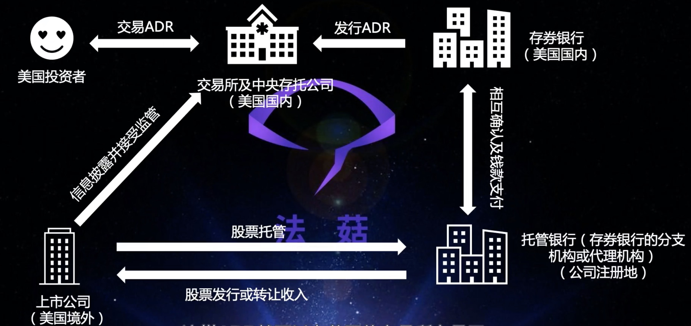

## 1. basics

- 美股
    - adr: American Depositary Receipt
        - 美国证券存托凭证
        - 国外公司的股票不能直接在美国上市交易，需要借助adr在美国交易；   
        - 
    - 中概股
        - 境内运营实体，境外上市实体
    
- 港股
    - 港交所不允许同股不同权
        - 阿里的合伙人制度：同股不同权；
