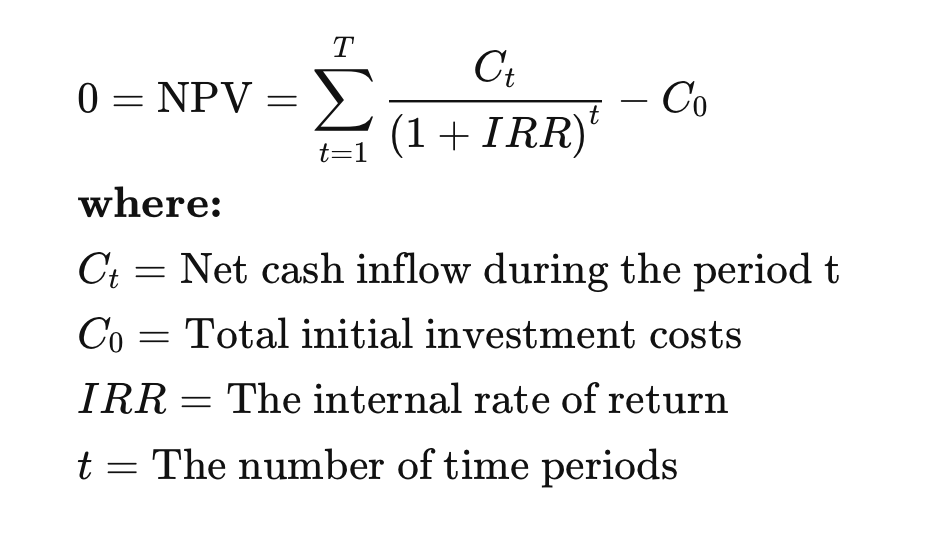

## 1. 概念及计算

- NPV: net present value
    - 金钱的时间价值：时间即金钱；
    - discounted cash flow (from fv)
    - （跨期）投资项目的比较；

- IRR: internal rate of return；
    - （跨期）投资项目的比较；
    - 有时 irr 也叫真实利率（        actual rate）
    - irr 就是 npv = 0 时对应的利率, irr 是 break-even point
        

## 2. 计算示例

- npv
    - 
- irr
    - 
- npv & irr
    - 
